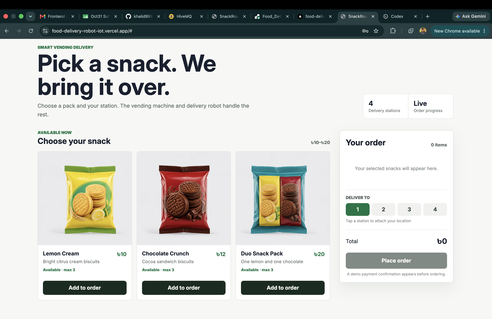
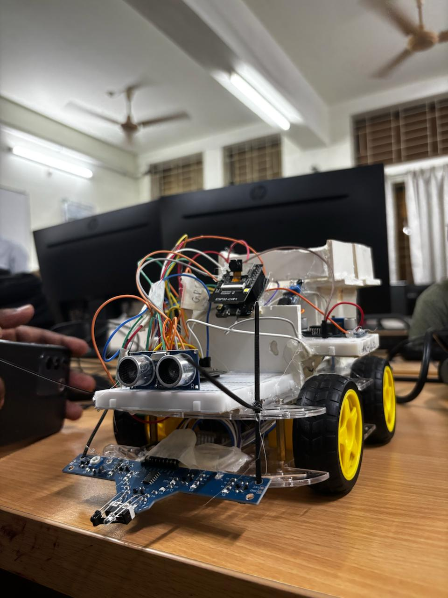
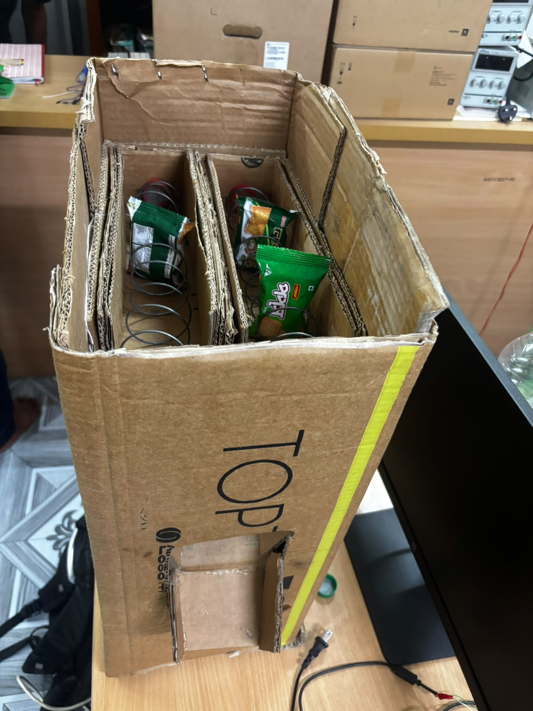
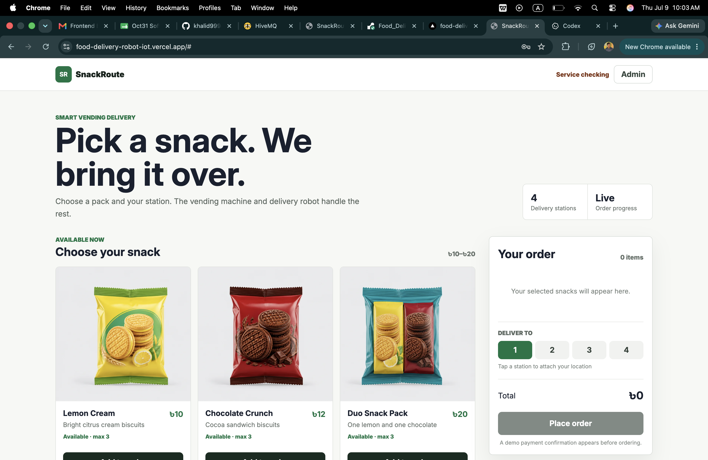
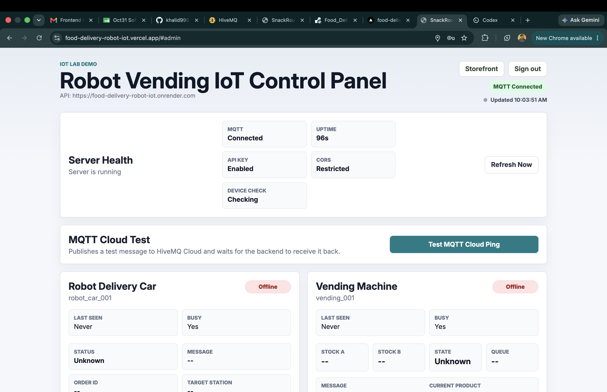
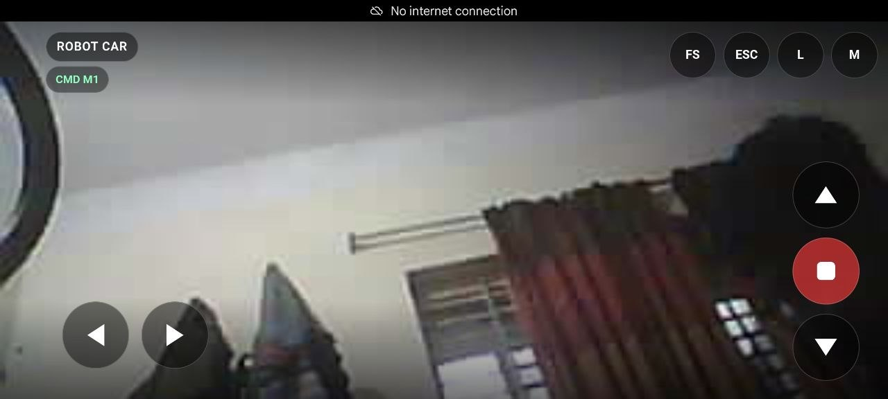
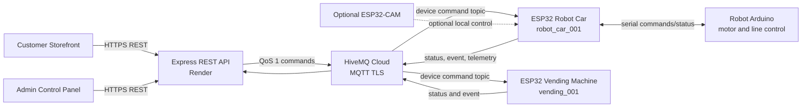
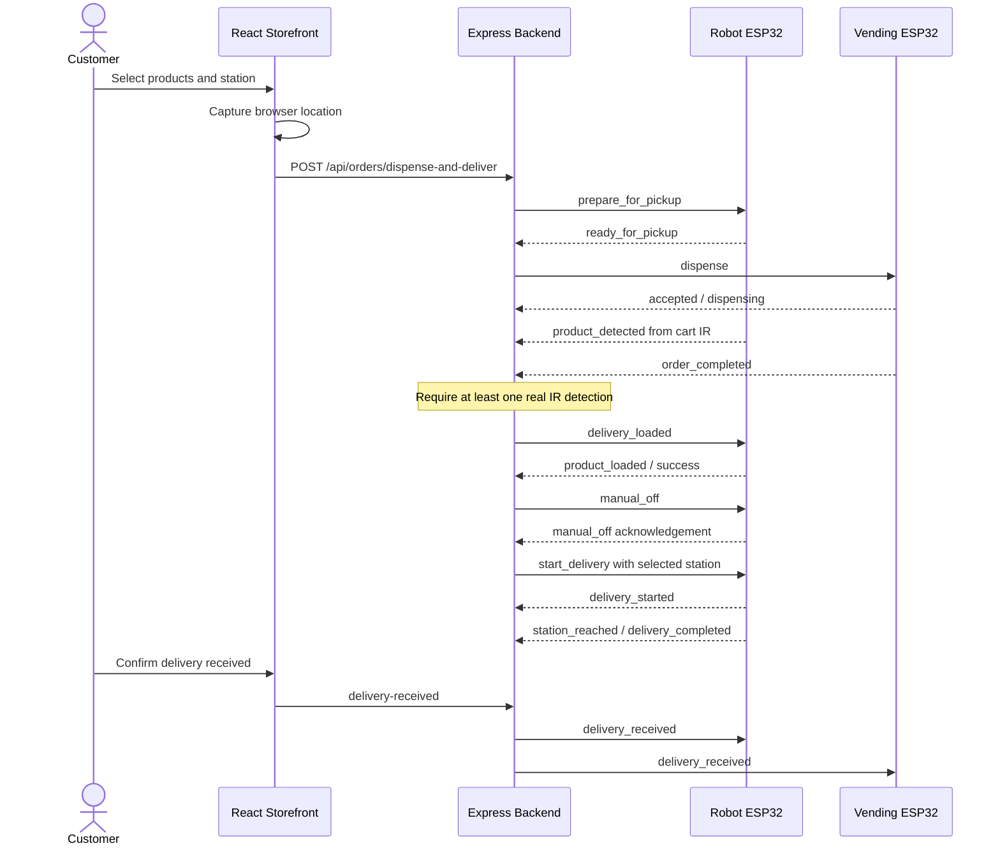

# SnackRoute (Food Delivery Robot Vending IoT System)

An end-to-end IoT lab project that coordinates a smart vending machine and an
ESP32 delivery robot through a reliable MQTT command pipeline. Customers select
snacks and a delivery station from a React storefront; operators monitor,
diagnose, and control both devices from a separate admin view.

<p align="center">
  
</p>

## Live Working Video

https://youtube.com/shorts/ReH7lZq-77Q?feature=share

## Project Status

This repository contains a deployable laboratory/demo implementation:

- React and Vite frontend for Vercel
- Express and Node.js backend for Render
- HiveMQ Cloud communication over MQTT TLS
- ESP32 robot and vending-machine command integration
- acknowledgement correlation, timeout handling, and limited retry behavior
- consumer ordering, demo payment confirmation, and live order progress
- admin device controls, diagnostics, telemetry, and safety monitoring

The project intentionally has no database and no production identity provider.
Orders and device snapshots are held in backend memory and are cleared whenever
the backend restarts.

## IOT Devices

| Delivery Robot                                                                  | Vending Machine                                                             |
| ------------------------------------------------------------------------------- | --------------------------------------------------------------------------- |
| Receives Packages from the Vending Machine and delivers to desired destination. | Interacts with user and selects desired Food Package.                       |
|        |  |

## Screens

| Customer storefront                                                                           | Admin control panel                                                                       |
| --------------------------------------------------------------------------------------------- | ----------------------------------------------------------------------------------------- |
| Select snacks, station, location, and confirm a demo payment.                                 | Monitor MQTT, device state, orders, stock, safety, and manual controls.                   |
|  |  |

The ESP32-CAM interface is an optional local/manual-control surface. The
storefront, backend, MQTT commands, telemetry, and robot safety do not depend on
the camera being online.

<p align="center">
  
</p>

## Architecture



The frontend never connects directly to MQTT. It calls the backend REST API,
and the backend owns broker credentials, command IDs, acknowledgement matching,
timeouts, retries, device state, and order orchestration.

## Repository Layout

The client and server are intentionally independent. There is no root
`package.json`, workspace, or monorepo tooling.

```text
delivery_robot/
|-- client/                       React + Vite application
|   |-- public/assets/
|   |-- src/
|   |   |-- App.jsx              view routing and admin dashboard
|   |   |-- ConsumerStorefront.jsx
|   |   |-- AdminLogin.jsx
|   |   |-- TelemetryPanel.jsx
|   |   |-- api.js
|   |   `-- styles.css
|   |-- .env.example
|   |-- package.json
|   |-- vercel.json
|   `-- vite.config.js
|-- server/                       Express + MQTT application
|   |-- src/
|   |   |-- middleware/
|   |   |-- routes/
|   |   |-- services/
|   |   |-- config.js
|   |   |-- devices.js
|   |   `-- topics.js
|   |-- .env.example
|   |-- index.js
|   |-- package.json
|   `-- render.yaml
|-- device_codes/                 ESP32 and Arduino sketches
|-- assets/                       README screenshots
|-- ALGORITHMS_AND_BUSINESS_LOGIC.md
`-- PROJECT_SUMMARY.md
```

## Main Capabilities

### Customer Experience

- three snack choices with a maximum demo quantity of three
- four delivery stations: `station_1` through `station_4`
- browser latitude/longitude capture when a station is selected
- demo payment confirmation before order submission
- live four-step order progress
- delivery receipt confirmation
- clickable progress markers for explicit lab/demo status overrides

### Admin Experience

- demo login and session-scoped admin view
- server, MQTT, API-key, CORS, and device-health status
- robot and vending online/offline state
- robot manual mode, keyboard control, emergency stop, and line-follow controls
- vending stock, dispense, refill, reset, and order controls
- ultrasonic distance and obstacle-stop warning
- GPS, cart IR, and ultrasonic telemetry panel
- MQTT cloud loopback test
- order simulation, load confirmation, delivery receipt, and force reset

### Reliability and Safety

- unique `commandId` for every command
- MQTT QoS 1 with `retain: false`
- acknowledgement matching by `deviceId + commandId`
- five-second command timeout by default
- one pending non-stop command per device
- one retry for a timed-out `delivery_loaded` command
- obstacle responses prevent forced autonomous movement
- autonomous commands disable manual mode before starting
- emergency stop remains available during obstacle/manual states
- stale devices become offline and are periodically pinged

## Order Lifecycle



For real orders, vending completion alone does not start the robot when the cart
has detected zero products. Once at least one IR `product_detected` event exists,
vending completion or website confirmation may validate the load. Reaching the
full expected count also starts the load-confirmation chain automatically.

`simulate_order_completed` is the explicit demo bypass and does not require an
IR detection.

## MQTT Contract

### Topics

| Purpose                | Pattern                        |
| ---------------------- | ------------------------------ |
| Commands               | `devices/{deviceId}/command`   |
| Acknowledgements/state | `devices/{deviceId}/status`    |
| Device events          | `devices/{deviceId}/event`     |
| Live robot sensors     | `devices/{deviceId}/telemetry` |

Registered devices:

- `robot_car_001`
- `vending_001`

### Command

```json
{
  "commandId": "cmd_1783560000000_a1b2c3d4",
  "deviceId": "robot_car_001",
  "command": "prepare_for_pickup",
  "params": {
    "orderId": "ORD_1783560000000",
    "targetStation": "station_2",
    "a": 1,
    "b": 1,
    "expectedProducts": 2,
    "userLocation": {
      "latitude": 22.8997,
      "longitude": 89.5023,
      "accuracy": 8,
      "capturedAt": "2026-07-09T03:00:00.000Z"
    }
  },
  "sentAt": "2026-07-09T03:00:01.000Z"
}
```

### Acknowledgement

```json
{
  "commandId": "cmd_1783560000000_a1b2c3d4",
  "deviceId": "robot_car_001",
  "status": "ready_for_pickup",
  "message": "Robot ready. Cart IR sensors armed.",
  "arduinoReply": "READY_FOR_PICKUP"
}
```

The ESP32 must return the original `commandId`. Status messages without a
matching pending key still update device/order state but do not resolve another
command.

## Safety Behavior

The robot ESP32 owns the immediate motor safety response. When ultrasonic
distance is below the configured threshold, it stops the Arduino and publishes
`obstacle_stop` or `obstacle_detected`.

The backend then:

1. marks the active order `blocked_by_obstacle`;
2. adds a timeline entry;
3. prevents load/start-delivery commands from being treated as successful; and
4. exposes the warning to both admin and customer interfaces.

`obstacle_cleared` is recorded, but the backend does not automatically resume
movement. An operator or valid order action must explicitly continue the flow.

## Location and Routing

The browser currently captures customer latitude, longitude, accuracy, and
capture time. These values travel through the order API and are included in
robot order commands when available.

The present robot route is selected by `station_1` to `station_4`. GPS
nearest-path calculation, route optimization, and route persistence are planned
extensions; they are not yet implemented in the backend.

## Local Development

Requirements:

- Node.js 20.19 or newer
- npm
- HiveMQ Cloud credentials
- ESP32 devices or an MQTT client for simulated acknowledgements

### Server

```bash
cd server
cp .env.example .env
npm install
npm start
```

The API starts on `http://localhost:3000` by default.

### Client

In a separate terminal:

```bash
cd client
cp .env.example .env
npm install
npm run dev
```

Open the Vite URL, normally `http://localhost:5173`.

Demo admin access:

```text
Username: admin02
Password: robot01
```

This login is intentionally frontend-only and suitable only for a lab demo.

## Environment Variables

### Backend

| Variable                    | Purpose                                    | Local default/example   |
| --------------------------- | ------------------------------------------ | ----------------------- |
| `PORT`                      | Express port                               | `3000`                  |
| `NODE_ENV`                  | Runtime mode                               | `development`           |
| `MQTT_HOST`                 | HiveMQ Cloud hostname                      | required                |
| `MQTT_PORT`                 | MQTT TLS port                              | `8883`                  |
| `MQTT_USERNAME`             | Broker username                            | required                |
| `MQTT_PASSWORD`             | Broker password                            | required                |
| `API_KEY`                   | Value accepted in `x-api-key`              | required in production  |
| `FRONTEND_ORIGIN`           | Allowed CORS origin(s)                     | `http://localhost:5173` |
| `COMMAND_TIMEOUT_MS`        | Device acknowledgement timeout             | `5000`                  |
| `DEVICE_PING_INTERVAL_MS`   | Periodic health probe interval             | `10000`                 |
| `DEVICE_OFFLINE_TIMEOUT_MS` | Stale-device cutoff                        | `25000`                 |
| `DEVICE_HEALTH_SWEEP_MS`    | Offline-state refresh interval             | `3000`                  |
| `LOG_LEVEL`                 | `debug`, `info`, `warn`, `error`, or `off` | `info`                  |

### Frontend

| Variable              | Purpose                 | Local value             |
| --------------------- | ----------------------- | ----------------------- |
| `VITE_API_BASE_URL`   | Express API base URL    | `http://localhost:3000` |
| `VITE_API_KEY`        | Sent as `x-api-key`     | same as backend         |
| `VITE_API_TIMEOUT_MS` | Browser request timeout | `15000`                 |

Never commit a real `.env` file or MQTT credentials.

## Deployment

### Render Backend

Create a Render web service from the same Git repository:

- root directory: `server`
- runtime: Node
- build command: `npm install`
- start command: `npm start`
- health check path: `/health`

Set the backend variables from `server/.env.example`. Recommended production
values include `NODE_ENV=production` and `LOG_LEVEL=off`. `render.yaml` contains
the non-secret service configuration; broker credentials and API keys must be
entered in Render.

### Vercel Frontend

Create a second project from the same repository:

- root directory: `client`
- framework preset: Vite
- build command: `npm run build`
- output directory: `dist`

Set `VITE_API_BASE_URL` to the Render HTTPS URL, set `VITE_API_KEY` to the
backend key, and set the backend `FRONTEND_ORIGIN` to the Vercel origin.

## Important API Endpoints

| Method | Endpoint                                          | Purpose                        |
| ------ | ------------------------------------------------- | ------------------------------ |
| `GET`  | `/health`                                         | server and MQTT health         |
| `GET`  | `/api/devices`                                    | all registered device states   |
| `POST` | `/api/devices/:deviceId/command`                  | direct allowed device command  |
| `POST` | `/api/mqtt/test-ping`                             | HiveMQ loopback test           |
| `POST` | `/api/orders/dispense-and-deliver`                | begin coordinated order        |
| `GET`  | `/api/orders/current`                             | current/latest order           |
| `POST` | `/api/orders/:orderId/confirm-loaded`             | real website load confirmation |
| `POST` | `/api/orders/:orderId/simulate-vending-completed` | demo IR bypass                 |
| `POST` | `/api/orders/:orderId/demo-progress`              | force demo progress step       |
| `POST` | `/api/orders/current/delivery-received`           | complete customer receipt      |
| `POST` | `/api/orders/current/force-reset`                 | admin order/device cleanup     |
| `POST` | `/api/devices/:deviceId/telemetry/start`          | open telemetry window          |
| `POST` | `/api/devices/:deviceId/telemetry/stop`           | stop telemetry stream          |

All `/api` requests require `x-api-key` when `API_KEY` is configured.

## Verification Checklist

1. Confirm `/health` returns `mqttConnected: true`.
2. Confirm both device cards become Online after heartbeat or periodic ping.
3. Run the MQTT cloud test without requiring either ESP32.
4. Ping each device and verify a matching command acknowledgement.
5. Place a one-product order and verify `prepare_for_pickup`.
6. Verify the vending machine receives the correct `a` and `b` quantities.
7. Drop a product through cart IR and verify `product_detected`.
8. Verify `delivery_loaded`, then `manual_off`, then `start_delivery`.
9. Trigger an obstacle and verify stop, warning, and no automatic resume.
10. Verify station completion exposes the delivery-received button.
11. Confirm delivery receipt notifies both devices and resets after five seconds.
12. Verify timeout behavior by withholding an acknowledgement.

## Known Demo Constraints

- no persistent database; restart clears orders and device snapshots
- demo payment only; no real payment provider
- hard-coded frontend admin login; not production authentication
- API key in a Vite environment variable is visible to browser users
- one active order and one pending non-stop command per device
- GPS coordinates are forwarded but not yet used for route optimization
- ESP32-CAM is optional and separate from the main cloud control path

## Further Documentation

- [Algorithms and Business Logic](docs/ALGORITHMS_AND_BUSINESS_LOGIC.md)
- [Project Summary](docs/PROJECT_SUMMARY.md)
- [Client Guide](client/README.md)
- [Server Guide](server/README.md)
