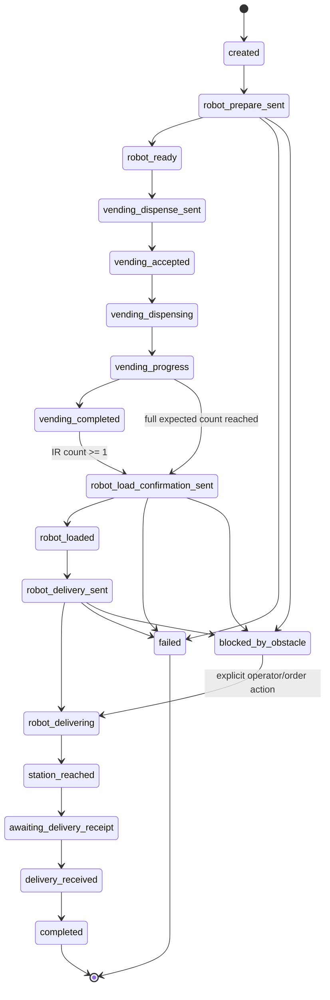

# Algorithms and Business Logic

This document describes the runtime logic behind the SnackRoute robot-vending
system. It is intended for implementation reviews, demonstrations, maintenance,
and AI-assisted development.

## 1. Domain Model

### Devices

| Device ID | Responsibility |
| --- | --- |
| `robot_car_001` | cart sensing, obstacle safety, line delivery, manual movement, GPS/telemetry |
| `vending_001` | stock state, product queue, dispensing, refill, reset |

### Order

An in-memory order contains:

```text
orderId
targetStation
userLocation
products { a, b }
status
detectedProductCount
vendingCompletionReceived
robotPrepareCommandId
vendingCommandId
deliveryLoadedCommandIds[]
robotDeliveryCommandId
acknowledgements
timeline[]
createdAt / updatedAt
```

There is no database. The order map is process-local and is reset whenever the
backend restarts or Render creates a new instance.

## 2. Business Rules

| Rule | Current behavior |
| --- | --- |
| Order quantity | `a >= 0`, `b >= 0`, and `a + b > 0` |
| Expected products | `max(1, a + b)` |
| Stations | exactly `station_1` through `station_4` |
| Active orders | only one active order is accepted |
| Device concurrency | one pending non-stop command per device |
| Command delivery | MQTT QoS 1, never retained |
| Acknowledgement | same `deviceId` and `commandId` |
| Command timeout | five seconds by default |
| Load retry | retry `delivery_loaded` once only after timeout |
| Real movement gate | at least one cart IR product detection |
| Full cart detection | full expected count can start load confirmation automatically |
| Vending completion fallback | may start load confirmation only after at least one IR detection |
| Demo bypass | `simulate_order_completed` may start without IR |
| Obstacle | stop/block flow; never auto-resume after clear |
| Manual/autonomous handoff | send `manual_off` before autonomous start |
| Delivery receipt | notify both devices; mark system complete after five seconds |
| Demo progress override | changes backend order status only; does not move hardware |

## 3. Order State Machine



The state model is tolerant of asynchronous MQTT updates. Device events can
advance an order independently from the original REST request.

## 4. Reliable MQTT Command Transfer

The backend generates a unique command ID and stores a pending promise before
publishing. This ordering prevents a very fast acknowledgement from arriving
before the pending entry exists.

```text
FUNCTION publishCommandAndWaitForAck(deviceId, command, params):
    IF MQTT is disconnected:
        RETURN error 503

    IF device already has pending non-stop command:
        RETURN error 409

    payload = {
        commandId: unique timestamp + random suffix,
        deviceId,
        command,
        params,
        sentAt: current ISO time
    }

    key = deviceId + ":" + payload.commandId
    pendingCommands[key] = promise resolvers + 5-second timer
    device.busy = true

    MQTT publish(
        topic = "devices/" + deviceId + "/command",
        payload = JSON(payload),
        qos = 1,
        retain = false
    )

    WAIT until:
        matching status arrives -> resolve with acknowledgement
        timeout expires         -> reject with HTTP 504
        broker disconnects      -> reject with HTTP 503

    remove pendingCommands[key]
    recompute device.busy
    RETURN acknowledgement or error
```

### Acknowledgement Correlation

```text
ON MQTT status(topic, message):
    parse JSON safely
    deviceId = validate device ID from topic
    reject payload when payload.deviceId conflicts with topic

    update device.latestStatus
    update device.lastSeenAt
    mark device online

    IF payload.commandId exists:
        key = deviceId + ":" + payload.commandId
        IF pendingCommands contains key:
            resolve only that command

    pass payload to order and safety handlers
```

QoS 1 can produce duplicate messages. Command IDs and idempotent state updates
keep duplicates from resolving unrelated commands.

## 5. Coordinated Dispense-and-Deliver Algorithm

```text
FUNCTION startDispenseAndDeliver(a, b, targetStation, userLocation):
    validate quantities, station, and coordinates
    reject when another order is active

    order = create in-memory order
    expectedProducts = max(1, a + b)

    prepareAck = SEND robot.prepare_for_pickup {
        orderId,
        targetStation,
        a,
        b,
        expectedProducts,
        userLocation
    }

    IF prepareAck is blocked:
        order.status = blocked_by_obstacle
        STOP

    IF prepareAck is not ready/success:
        order.status = failed
        STOP

    order.status = robot_ready

    vendingAck = SEND vending.dispense {
        orderId,
        a,
        b,
        targetStation
    }

    IF vendingAck is not accepted/success/ready/completed:
        order.status = failed
        STOP

    order.status = vending_accepted or vending_completed
    RETURN order-started response
```

The REST response does not need to remain open for the complete physical
delivery. Later MQTT events continue the order asynchronously.

## 6. Cart IR and Load-Confirmation Logic

The real flow must have physical evidence that at least one object reached the
cart. This prevents a vending-complete message from starting an empty robot.

```text
ON robot product_detected(payload):
    reportedCount = payload.cart.productCount
                    OR payload.productCount
                    OR payload.detectedProducts

    IF count is absent:
        detectedProductCount = max(previousCount, 1)
    ELSE:
        detectedProductCount = max(previousCount, reportedCount)

    append product detection to order timeline

    IF vending completion was already received:
        confirmOrderLoaded()
    ELSE IF detectedProductCount >= expectedProducts:
        confirmOrderLoaded()
    ELSE:
        WAIT for more IR detections or vending completion
```

Using `max(previousCount, reportedCount)` makes repeated QoS 1 events safe. A
duplicate `product_detected` packet does not increment the order twice.

### Vending Completion

```text
ON vending completed:
    order.vendingCompletionReceived = true
    order.status = vending_completed

    IF detectedProductCount < 1:
        timeline += "waiting for cart IR detection"
        STOP

    confirmOrderLoaded(source = vending)
```

### Website Confirmation

The real "Confirm Products Loaded / Start Delivery" action uses the same policy:
it is rejected with HTTP 409 when `detectedProductCount < 1`.

## 7. Delivery-Loaded Retry and Start Logic

```text
FUNCTION confirmOrderLoaded(order):
    reject failed or obstacle-blocked order
    reject when detectedProductCount < 1
    reuse existing in-flight confirmation for same order

    FOR attempt IN [1, 2]:
        ack = SEND robot.delivery_loaded(full order parameters)

        IF ack indicates obstacle:
            order.status = blocked_by_obstacle
            STOP

        IF ack.status is product_loaded or success:
            order.status = robot_loaded
            startRobotDelivery(order)
            RETURN success

        IF timeout AND attempt == 1:
            CONTINUE with a new commandId

        order.status = failed
        RETURN "Robot load confirmation failed"
```

Each retry is a new MQTT command and therefore has a different `commandId`.

## 8. Autonomous-Mode Handoff

Manual commands can cancel the Arduino line-following state. Before a real or
simulated autonomous start, the backend explicitly returns the robot to
autonomous ownership.

```text
FUNCTION startRobotDelivery(order):
    SEND robot.manual_off { reason: "start_delivery" }
    require non-failed acknowledgement

    ack = SEND robot.start_delivery {
        orderId,
        targetStation,
        a,
        b,
        expectedProducts,
        userLocation
    }

    IF ack is blocked or obstacle_stop:
        order.status = blocked_by_obstacle
    ELSE IF ack is failed, error, or rejected:
        order.status = failed
    ELSE IF ack is delivery_started or success:
        order.status = robot_delivering
    ELSE IF ack is delivery_queued:
        order.status = robot_delivery_sent
    ELSE:
        order.status = failed
```

Unknown acknowledgements fail closed. The backend no longer reports success for
`delivery_start_rejected`.

## 9. Demo Simulation

`simulate_order_completed` is deliberately separate from the real load
confirmation:

```text
FUNCTION simulateOrderCompleted(orderId, targetStation):
    SEND robot.manual_off
    SEND robot.simulate_order_completed {
        orderId,
        targetStation,
        userLocation
    }
    validate started/queued/success acknowledgement
```

This is the only supported zero-IR bypass. It exists for lab demonstrations when
physical dispensing or cart sensors are unavailable.

## 10. Ultrasonic Obstacle Safety

Immediate stopping belongs on the ESP32/Arduino path because cloud latency is
not acceptable for collision prevention.

```text
ESP32 LOOP:
    distanceCm = read ultrasonic sensor

    IF distanceCm < 8 AND obstacle stop is inactive:
        send "CMD,S" to Arduino
        obstacleStopActive = true
        publish obstacle_stop / obstacle_detected

    IF distanceCm >= clear threshold AND obstacle stop is active:
        obstacleStopActive = false
        publish obstacle_cleared
        DO NOT restart motors
```

```text
BACKEND ON obstacle_stop or obstacle_detected:
    activeOrder.status = blocked_by_obstacle
    append warning once to timeline
    reject movement/load chain as blocked

BACKEND ON obstacle_cleared:
    append cleared event once
    leave order paused
```

Emergency stop remains enabled in the frontend regardless of obstacle state.

## 11. Device Online/Offline Detection

An MQTT broker connection proves only that the backend is online. It does not
prove that either ESP32 is online.

```text
ON backend MQTT connect/reconnect:
    subscribe to status, event, telemetry, and test topics
    schedule ping for each known device

EVERY DEVICE_PING_INTERVAL_MS:
    FOR each device:
        skip when device has a pending command
        SEND ping
        success -> online = true; update lastSeenAt
        timeout -> online = false

EVERY DEVICE_HEALTH_SWEEP_MS:
    IF now - lastSeenAt > DEVICE_OFFLINE_TIMEOUT_MS:
        online = false

ON any valid status/event:
    online = true
    lastSeenAt = now
```

## 12. Manual Keyboard Control

Keyboard motion is active only while robot manual mode is on.

```text
ON keydown:
    ignore when focus is inside input/textarea/select
    ignore browser repeat events
    ignore when manual mode is off

    W or ArrowUp    -> forward
    S or ArrowDown  -> backward
    A or ArrowLeft  -> left
    D or ArrowRight -> right
    Space           -> stop

ON movement keyup:
    SEND stop
```

Movement continues until key release or explicit stop. The frontend does not
depend on `durationMs` for motor safety.

## 13. Delivery Completion

```text
ON robot delivery_completed:
    order.status = awaiting_delivery_receipt
    show receipt button in customer and admin interfaces

ON customer/admin confirms receipt:
    order.status = delivery_received
    IN PARALLEL:
        SEND robot.delivery_received
        SEND vending.delivery_received

    record acknowledgement results
    after 5 seconds:
        order.status = completed
```

Receipt completion is best-effort: the business event is recorded even if one
device does not acknowledge, while the response clearly reports the issue.

## 14. Consumer Progress Override

The clickable progress numbers are an explicit demonstration tool:

| Step | Forced backend status |
| --- | --- |
| 1 | `robot_ready` |
| 2 | `vending_dispensing` |
| 3 | `robot_delivering` |
| 4 | `awaiting_delivery_receipt` |

```text
POST /api/orders/:orderId/demo-progress { step }
validate step is 1..4
set mapped order status
append source and step to timeline
return updated order
```

This endpoint does not publish MQTT commands. It changes display/business state
only and should not be confused with real physical progression.

## 15. Telemetry

Telemetry is intentionally separate from command acknowledgements.

```text
Admin opens telemetry:
    SEND start_telemetry
    poll/read latest backend telemetry

ESP32 publishes:
    GPS coordinates
    cart IR states and counts
    ultrasonic distance and obstacle flag
    robot mode and uptime

Backend:
    store latest telemetry
    keep bounded in-memory history
    expose latest/history through REST

Admin closes telemetry:
    SEND stop_telemetry
```

The ESP32-CAM is optional and is not part of this telemetry requirement.

## 16. Location and Future Nearest-Path Logic

Current implementation:

```text
ON station selection:
    browser requests geolocation
    validate latitude in [-90, 90]
    validate longitude in [-180, 180]
    attach location to order
    forward location in robot order commands
```

Nearest-path calculation is a planned module, not current behavior. A future
implementation could use:

```text
INPUT:
    robot GPS coordinate
    customer coordinate
    known route graph (nodes, edges, distances, blocked edges)

nearestStation = station minimizing haversine(customer, station.coordinate)
path = A_STAR(
    graph,
    start = nearest graph node to robot,
    goal = nearest graph node to nearestStation,
    edgeCost = distance + safety penalties
)

SEND route/path identifier to robot
TRACK robot GPS against expected path
RECALCULATE only when deviation or blocked edge exceeds threshold
```

This requires a calibrated map/graph and should not be represented as complete
until those data and algorithms exist in the backend.

## 17. Module Ownership

### Frontend

| Module | Responsibility |
| --- | --- |
| `ConsumerStorefront.jsx` | catalog, cart, station/location, payment modal, progress, receipt |
| `App.jsx` | admin dashboard, controls, polling, keyboard movement, view routing |
| `AdminLogin.jsx` | demo-only client-side login |
| `TelemetryPanel.jsx` | live sensor presentation |
| `api.js` | REST requests, API key header, browser timeout |
| `styles.css` | responsive storefront/admin presentation |

### Backend

| Module | Responsibility |
| --- | --- |
| `commandService.js` | command IDs, pending map, MQTT publish, timeout, ack resolution |
| `mqttService.js` | broker lifecycle, subscriptions, reconnect behavior |
| `messageHandlers.js` | safe parsing, device validation, status/event routing |
| `deviceHealthService.js` | startup/periodic pings and online state |
| `orderFlowService.js` | prepare robot and begin vending |
| `robotPickupService.js` | IR evidence and pickup-complete handling |
| `vendingCompletionService.js` | vending completion recognition and load gate |
| `deliveryLoadedService.js` | load confirmation, policy, retry |
| `robotAutonomyService.js` | manual-to-autonomous handoff |
| `robotDeliveryService.js` | start-delivery command and ack validation |
| `robotSafetyHandler.js` | obstacle order-state handling |
| `orderCompletionService.js` | delivery receipt fan-out and delayed completion |
| `orderStore.js` | in-memory orders, active-state lookup, timeline |
| `telemetryHandler.js` | latest and bounded sensor history |

## 18. HTTP Error Semantics

| Code | Meaning |
| --- | --- |
| `400` | invalid device command, quantity, station, location, or demo step |
| `401` | missing or invalid API key |
| `404` | device/order/route not found |
| `409` | active order conflict, device busy, obstacle/load-policy conflict |
| `502` | device rejected command or publish failed |
| `503` | MQTT unavailable |
| `504` | device acknowledgement timeout |

## 19. Production Hardening Roadmap

Before treating the lab demo as a production service:

1. replace in-memory orders with a transactional database;
2. add idempotency keys for HTTP order creation;
3. move authentication and authorization to the backend;
4. never treat a browser-visible Vite key as a secret;
5. integrate a real payment provider with signed webhooks;
6. persist device events and audit history;
7. add per-device MQTT authorization and certificate rotation;
8. implement a calibrated route graph before claiming nearest-path routing;
9. add automated integration tests with an MQTT device simulator; and
10. define recovery rules for backend restarts during active physical orders.
